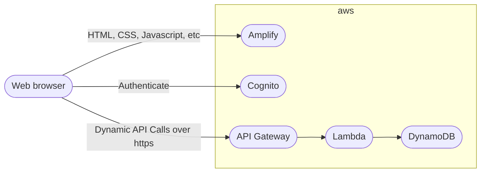
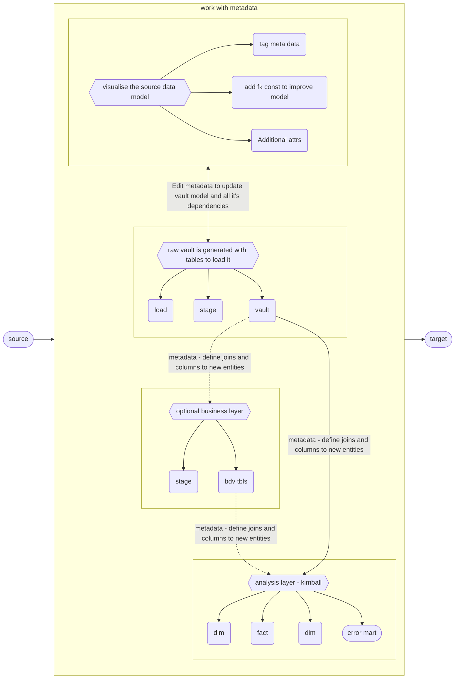

# Pensieve 

## About
This is a personal project to explore and learn Vue and serverless technology in aws 





### Basic concept
Main goal is to build a web app that can connect to a database, read and import metadata to draw it's data model. 
Add more metadata to generate a logical raw data vault model. Use the logical model to create business layer on top of the raw vault. Then generate code to create and load data into targeted platform.  
Genereated code will utilize jinja2 templates to make it easy to update the templates to follow a specific pattern valid for each user. All generated code will be accessable to the user and can be stored in git.  
No heavy lifting will be done by the app, it will use the power of the targeted platform to transform data and follow the ELT principles.  


### Data model
All metadata extracted from source and created in app is stored in a database or git repo. Would prefer to store as files to more easaliy version control it. (An interesting repo to explore regarding storing metadata for dwa: https://github.com/RoelantVos/Data-Warehouse-Automation-Metadata-Schema/blob/master/Documentation/DataWarehouseAutomationInterface.md).  
It's used to generate code to build the data warehouse.  
No secrets or actual data will ever be stored in the database, only descriptive data.

<!-- ```mermaid
erDiagram
    owner ||--o{ project : owns
    project ||--o{ user : have   
    project ||--o{ environment : have
    environment ||--o{ secret : have
    environment ||--o{ dataConnection : have
    dataConnection }|--o{ secret : use
    dataConnection }|--|{ dataObject : uses
    dataObject ||--o{ dataItem : have
    dataItem ||--o{ dataTag : have
    dataObject ||--o{ dataTag : have
    tag ||--o{ dataTag : have
``` -->


Scope:  
- [x] Possibility to work on different projects
- [ ] Define project environment
- [ ] Store secrets in environment
- [ ] Define connection to source
- [ ] To get data from APIs user need to add custom code to browse and fetch data from api
- [ ] To process specific file structures user need to add code to do so
- [ ] Create Error Marts to track faulty data from source systems 
- [ ] Define connection to target platform 
- [ ] Create all physical tables, views and stored procedures for targeted platform 
- [ ] Choose how to execute and schedule jobs to load target platform with data
- [ ] Display lineage source -> target  
- [ ] Document everything  


We'll use Vue 3 `<script setup>` SFCs as much as possible, check out the [script setup docs](https://v3.vuejs.org/api/sfc-script-setup.html#sfc-script-setup) to learn more.  


## Recommended IDE Setup  

- [VS Code](https://code.visualstudio.com/) + [Volar](https://marketplace.visualstudio.com/items?itemName=johnsoncodehk.volar)


