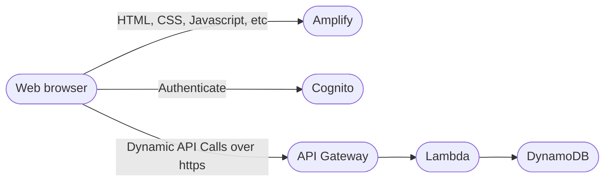

# Pensieve 

This is a personal project to explore and learn Vue. 
Main goal is to build some web app that can connect to a database, read and import meta data to draw it's data model. 
Add more meta data to generate a logical raw data vault model. Use the logical model to create business layer on top of the raw vault

Scope:  
- [x] Possibility to work on different projects
- [ ] Define project environment
- [ ] Store secrets in environment
- [ ] Define connection to source
- [ ] Connect to source and browse it's content
- [ ] Load meta data into metadata db
- [ ] Add Data Vault attributes to tables and columns
- [ ] Create logical Data Vault model based on tags
- [ ] Create Business Vault and/or Information Marts on top of Raw Vault
- [ ] Create Error Marts to track faulty data from source systems 
- [ ] Define connection to taget platform 
- [ ] Create all physical tables, views and stored procedures for target platform 
- [ ] Choose how to execute and schedule jobs to load target platform with data
- [ ] Display lineage source -> target  
- [ ] Document everything  

We'll use Vue 3 `<script setup>` SFCs as much as possible, check out the [script setup docs](https://v3.vuejs.org/api/sfc-script-setup.html#sfc-script-setup) to learn more.  

## Recommended IDE Setup  

- [VS Code](https://code.visualstudio.com/) + [Volar](https://marketplace.visualstudio.com/items?itemName=johnsoncodehk.volar)

